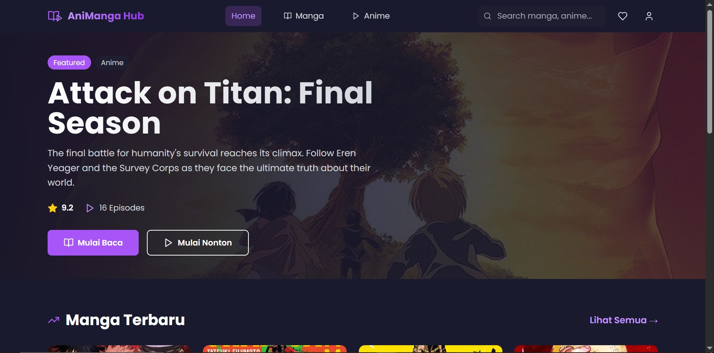

# 🎬 Aniverse - Anime & Manga Streaming Platform

<div align="center">
  
  
  [](https://reactjs.org/)
  [](https://www.typescriptlang.org/)
  [](https://vitejs.dev/)
  [](https://tailwindcss.com/)
</div>

## 📖 About

**Aniverse** is a modern, responsive anime and manga streaming platform built with React, TypeScript, and Tailwind CSS. Experience seamless browsing, watching, and reading with a beautiful, user-friendly interface optimized for all devices.

## 🚀 Live Demo

Check out the live demo: **[https://aniverse-manga.vercel.app/](https://aniverse-manga.vercel.app/)**

## 🛠️ Tech Stack

- **Frontend Framework:** React 18.3.1
- **Language:** TypeScript 5.5.3
- **Build Tool:** Vite 5.4.2
- **Styling:** Tailwind CSS 3.4.1
- **Icons:** Lucide React
- **Deployment:** Vercel

## 📋 Prerequisites

Before you begin, ensure you have the following installed:

- **Node.js** (v18.0.0 or higher)
- **npm** (v9.0.0 or higher) or **yarn** (v1.22.0 or higher)
- **Git**

## 🔧 Installation & Setup

### 1. Clone the Repository

```bash
git clone https://github.com/yourusername/manga-anime-website.git
cd manga-anime-website
```

### 2. Install Dependencies

Using npm:
```bash
npm install
```

Or using yarn:
```bash
yarn install
```

### 3. Run Development Server

Using npm:
```bash
npm run dev
```

Or using yarn:
```bash
yarn dev
```

The application will be available at `http://localhost:5173`

### 4. Build for Production

Using npm:
```bash
npm run build
```

Or using yarn:
```bash
yarn build
```

### 5. Preview Production Build

Using npm:
```bash
npm run preview
```

Or using yarn:
```bash
yarn preview
```

## 🙏 Acknowledgments

- Sample videos from [Google Test Videos](https://commondatastorage.googleapis.com/gtv-videos-bucket/sample/)
- Icons from [Lucide React](https://lucide.dev/)
- UI inspiration from modern streaming platforms

## 📞 Support

If you have any questions or need help, please open an issue in the GitHub repository.

---

<div align="center">
  Made with ❤️ using React, TypeScript, and Tailwind CSS
  
  ⭐ Star this repo if you find it helpful!
</div>
